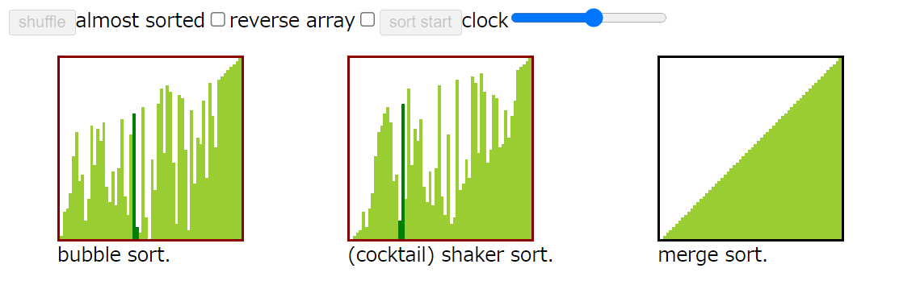

# Make sorting visual (`element`)
This visualizes sorting algorithms like many other examples found when googling gif of sorts.
  
This uses html element `div`. It is easy to style.

# How to add sort to `mountAll()`
## in `sortfunc.ts` (or any other file)
- add function that satisfies type `SORTFUNC`
    - use `ArrayWrap` methods to compare/swap/copy and `await` them
    - `export` the function
    - implement like other sorts
## in `setting.ts`
- add sort into `sortDict` (import the function)
## in `index.html`
- add element that satisfies `sortDict` selector

# How to perform sort individually
- `new SortWrap()` all sorts
- put buttons and inputs to Object `: CONTROLS`
- `new Sort(...).mount()`
    - uncomment html example at the bottom and see `individual.ts`

# How to use
```bash
git clone https://github.com/halfminami/visual-sorting-algorithm.git
cd visual-sorting-algorithm
npm install
npm run tsc
```
Because of using `script type="module"`, need to run a local server
```bash
npm run start
```
and enter the url into browser (only checked on chrome)

## Notes
Clock for sorting (times to compare/swap/copy) was randomly chosen by me. The actual time differs by architecture.

## Sorts I implemented
I'm afraid I might have implemented wrong!
- bubble sort
- cocktail shaker sort
- merge sort
    - simple merge sort
    - parallel merge
- gnome sort
- radix sort (base 5 `"ABCDE"`)
- insertion sort
    - simple swap
    - binary search
- selection sort
    - simple max select
    - double select
- shell sort
    - divide by 2
    - divide by 3 (improved gap)
- comb sort
- quick sort
    - simple quick sort, pivot: `(left + right) / 2`
    - parallel quick sort, pivot: `(left + right) / 2`
- circle sort
- heap sort
- odd even sort (parallel)
- cycle sort
